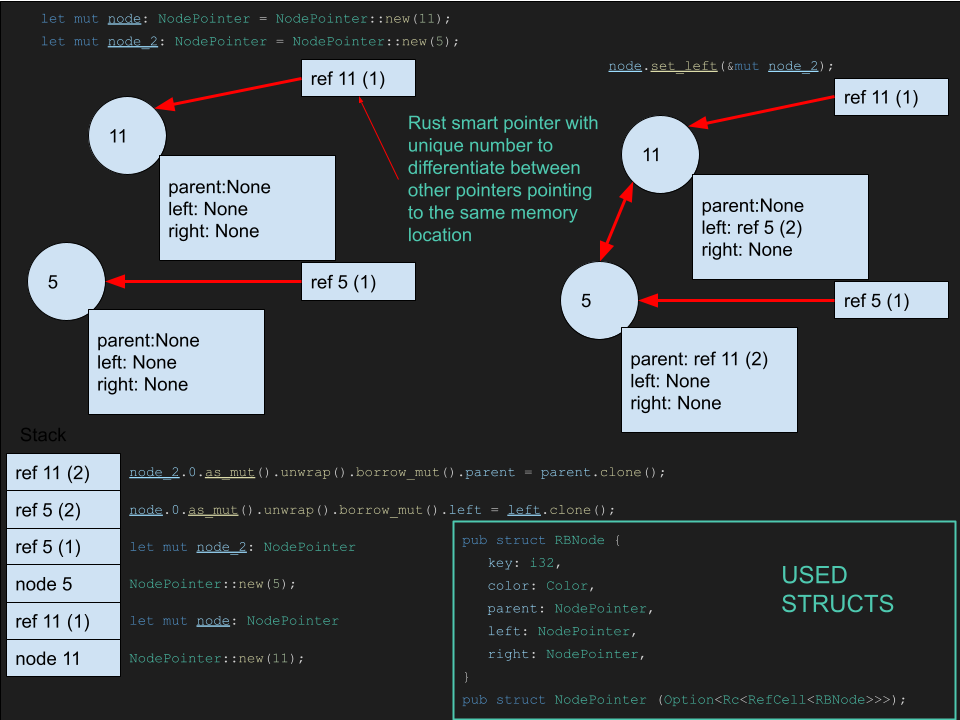

# Red Black Tree

A red-black tree is a kind of self-balancing binary search tree in computer science. Each node of the binary tree has an extra bit, and that bit is often interpreted as the color (red or black) of the node. These color bits are used to ensure the tree remains approximately balanced during insertions and deletions.

## Properties

1. Every node is either red or black.
2. The root is black.
3. Every leaf (NIL) is black.
4. If a node is red, then both its children are black.
5. For each node, all simple paths from the node to descendant leaves contain the same number of black nodes.

## Insertion

1. Perform the normal BST insertion (Binary Search Tree)
2. Color the new node red
3. Perform rotations and color flips to fix violations

## Deletion

1. Perform standard BST deletion
2. If the deleted node was red, we are done
3. If the deleted node was black, remove one black from the path from the deleted node to the root
4. If the sibling is red, rotate the parent so that the sibling becomes the parent and the parent becomes the sibling
5. If the sibling is black, and both of the sibling's children are black, color the sibling red and repeat from step 3 for the parent
6. If the sibling is black, and the left child is red and the right child is black, rotate the sibling so that the left child becomes the sibling and the sibling becomes the parent
7. If the sibling is black, and the right child is red, color the sibling with the parent's color, color the parent black, color the right child black, and rotate the parent

## Complexity

| Operation | Complexity |
| --------- | ---------- |
| Search    | O(log n)   |
| Insert    | O(log n)   |
| Delete    | O(log n)   |

## Implementation in Rust

Implementing a red black tree in rust is a bit tricky. The main problem is that rust doesn't allow you to have a mutable reference to a struct and a mutable reference to one of its fields at the same time. This is a problem because we need to be able to have a mutable reference to the root node and a mutable reference to the parent node at the same time. To solve this problem we will use the [RefCell](https://doc.rust-lang.org/std/cell/struct.RefCell.html) type. This type allows us to have multiple mutable references to the same data. This is a bit unsafe because we can have multiple mutable references to the same data at the same time. This is why we will use the [RefCell](https://doc.rust-lang.org/std/cell/struct.RefCell.html) type only when we need to have multiple mutable references to the same data.



```rust
use std::rc::Rc;
use std::cell::RefCell;
use std::env;
use std::fs::{File, Metadata};
use std::io::{Write, Read, Error, Seek, SeekFrom};

#[derive(Copy, Clone, PartialEq, Eq)]
enum Color {
    RED,
    BLACK,
}

pub struct RBNode {
    key: i32,
    color: Color,
    parent: NodePointer,
    left: NodePointer,
    right: NodePointer,
}

impl Drop for RBNode {
    fn drop(&mut self) {
        println!("droping node: {}", self.key);
    }
}
// normaly you would never clone a node only if creating a clone of the tree
impl Clone for RBNode {
    fn clone(&self) -> RBNode {
        println!("cloning node {}", self.key);
        let node = RBNode {
            key: self.key,
            color: self.color,
            parent: self.parent.clone(),
            left: self.left.clone(),
            right: self.right.clone(),
        };
        node
    }
}

//abstracts away the fact that we are using smart pointers for cleaner code
pub struct NodePointer (Option<Rc<RefCell<RBNode>>>);

impl Drop for NodePointer {
    fn drop(&mut self) {
        if self.0.is_some() {
            //println!("droping refrence count: {} to node: {}", Rc::strong_count(&(self.0.clone().unwrap()))-1, self.0.as_ref().unwrap().borrow().key);
        }
    }
}


impl Clone for NodePointer {
    fn clone(&self) -> NodePointer {
        if self.is_nil(){
            return NodePointer::nil();
        }
        //println!("cloning refrence to node: {}", self.0.as_ref().unwrap().borrow().key);
        NodePointer(self.0.clone())
    }
}

//do pointers point to same memory location
impl PartialEq for NodePointer {
    fn eq(&self, other: &NodePointer) -> bool {
        //only unwrap value if you are shure what it is  <-- test if this works
        self.0.is_some() && other.0.is_some() && Rc::ptr_eq(&self.0.as_ref().unwrap(), &other.0.as_ref().unwrap())
    }
}

impl Eq for NodePointer {}

/* ********implementiraj pomozne funkcije ki bodo olajsale programiranje */

impl NodePointer {
    fn new (val: i32) -> NodePointer {
        let node = RBNode {
            key: val,
            color: Color::RED,
            parent: NodePointer::nil(),
            left: NodePointer::nil(),
            right: NodePointer::nil(),
        };
        NodePointer(Some(Rc::new(RefCell::new(node))))
    }

    #[inline]
    fn nil() -> NodePointer {
        NodePointer(None)
    }

    #[inline] //check if node is nil node
    fn is_nil(&self) -> bool {
        self.0.is_none() //there is no smart pointer to node
    }

    #[inline] //check if node is nil node only unwrap value if you are shure what it is
    fn is_red(&self) -> bool {
        if self.is_nil() {
            return false;
        }
        self.0.as_ref().unwrap().borrow().color == Color::RED
    }

    #[inline] //nil node is black
    fn is_black(&self) -> bool {
        if self.is_nil() {
            return true;
        }
        self.0.as_ref().unwrap().borrow().color == Color::BLACK
    }

    #[inline]
    fn set_color(&mut self, color: Color) {
        if self.is_nil() {
            return;
        }
        self.0.as_mut().unwrap().borrow_mut().color = color;
    }

    #[inline]
    fn set_parent(&mut self, parent: &NodePointer) {
        if self.is_nil() {
            return;
        }
        self.0.as_mut().unwrap().borrow_mut().parent = parent.clone();
    }

    #[inline]
    fn set_left(&mut self, left: &NodePointer) {
        if self.is_nil() {
            return;
        }
        self.0.as_mut().unwrap().borrow_mut().left = left.clone();
        //left.set_parent(self);
    }

    #[inline]
    fn set_right(&mut self,right: &NodePointer) {
        if self.is_nil() {
            return;
        }
        self.0.as_mut().unwrap().borrow_mut().right = right.clone();
        //right.set_parent(self);
    }

    #[inline]
    fn get_color(&self) -> Color {
        if self.is_nil() {
            return Color::BLACK;
        }
        self.0.as_ref().unwrap().borrow().color
    }

    #[inline]
    fn key(&self) -> i32 {
        if self.is_nil() {
            return 0;
        }
        self.0.as_ref().unwrap().borrow().key.clone()
    }

    #[inline]
    fn left(&self) -> NodePointer {
        if self.is_nil() {
            return NodePointer::nil();
        }
        self.0.as_ref().unwrap().borrow().left.clone()
    }

    #[inline]
    fn right(&self) -> NodePointer {
        if self.is_nil() {
            return NodePointer::nil();
        }
        self.0.as_ref().unwrap().borrow().right.clone()
    }

    #[inline]
    fn parent(&self) -> NodePointer {
        if self.is_nil() {
            return NodePointer::nil();
        }
        self.0.as_ref().unwrap().borrow().parent.clone()
    }

    #[inline]
    fn minimum(&self) -> NodePointer {
        let mut temp = self.clone();
        while !temp.left().is_nil() {
            temp = temp.left();
        }
        return temp;
    }

    pub fn print_digraf_node(&self){
        if self.is_nil() {
            return;
        }
        if self.parent().is_nil() {
            println!("{}[color=\"{}\"];",
            self.key(), if self.get_color() == Color::RED {"red"} else {"black"});
        }else{
            println!("{} -> {};{}[color=\"{}\"];",
            self.parent().key(), self.key(),
            self.key(), if self.get_color() == Color::RED {"red"} else {"black"});
        }
        self.left().print_digraf_node();
        self.right().print_digraf_node();
    }

    fn clean(&mut self) {
        if self.is_nil() {
            return;
        }
        self.0.as_mut().unwrap().borrow_mut().parent = NodePointer::nil();
        self.left().clean();
        self.0.as_mut().unwrap().borrow_mut().left = NodePointer::nil();
        self.right().clean();
        self.0.as_mut().unwrap().borrow_mut().right = NodePointer::nil();
    }


}


pub struct RBTree {
    root: NodePointer,
}

impl Drop for RBTree {
    fn drop(&mut self) {
        println!("dropping tree");
        /*if self.root.is_nil(){ // managed to create a memory leak ? <--------------
            return;              // some nodes are never dropped
        }
        self.root.clean();*/

    }
}

impl RBTree {

    pub fn new() -> RBTree {
        println!("new tree created");
        RBTree { 
            root: NodePointer::nil(),
            
        }
    }

    pub fn insert(&mut self, key: i32) {
        
        let mut z = NodePointer::new(key);
        let mut x = self.root.clone();
        let mut y = NodePointer::nil();

        //search for node y to atach to
        while !x.is_nil() {
            y = x.clone();
            if key < x.key() {
                x = x.left();
            } else if key > x.key() {
                x = x.right();
            }
        }
        if y.is_nil() { //if tree is empty
            self.root = z.clone();
        } else if key < y.key() { //if key is smaller than parent
            y.set_left(&mut z);
        } else { //if key is bigger than parent
            y.set_right(&mut z);
        }
        z.set_parent(&y);

        self.insert_fix(z.clone());
        
        
    }
    
    //TODO lookup rust exeptions

    /// Rotates the subtree rooted at x to the right.
    /// returns 0 if suscessful
    /// returns -1 if left child is nil
    pub fn right_rotate(&mut self, mut x : NodePointer) -> i32{

        let mut y = x.left();
        if y.is_nil() {println!("left child is nil right rotation not possible"); return -1; }
        x.set_left(&mut y.right());
        if !y.right().is_nil() {
            y.right().set_parent(&x);
        }
        y.set_parent(& x.parent());

        if x == self.root {
            self.root = y.clone();
        } else if x == x.parent().right() {
            x.parent().set_right(&y);
        } else {
            x.parent().set_left(&y);
        }
        y.set_right(&x);
        x.set_parent(&y);
        return 0;
    }
    /// Rotates the subtree rooted at x to the left.
    /// returns 0 if suscessful
    /// returns -1 if right child is nil
    pub fn left_rotate(&mut self, mut x: NodePointer) -> i32{

        let mut y = x.right();
        if y.is_nil() {println!("right child is nil left rotation not possible"); return -1; }
        x.set_right(&mut y.left());
        if !y.left().is_nil() {
            y.left().set_parent(& x);
        }
        y.set_parent(& x.parent());
        if x == self.root {
            self.root = y.clone();
        } else if x == x.parent().left() {
            x.parent().set_left(&y);
        } else {
            x.parent().set_right(&y);
        }
        y.set_left(&x);
        x.set_parent(&y);
        return 0;
        
    }
    pub fn insert_fix(&mut self,mut node: NodePointer){
        let mut parent;
        let mut gparent;

        while node.parent().is_red() {
            parent = node.parent();
            gparent = parent.parent();

            if parent == gparent.left() {

                let mut uncle = gparent.right();
                if !uncle.is_nil() && uncle.is_red() {
                    uncle.set_color(Color::BLACK);
                    parent.set_color(Color::BLACK);
                    gparent.set_color(Color::RED);
                    node = gparent;
                    continue;
                }

                if parent.right() == node {
                    self.left_rotate(parent.clone());
                    let temp = parent;
                    parent = node;
                    node = temp;
                }

                parent.set_color(Color::BLACK);
                gparent.set_color(Color::RED);
                self.right_rotate(gparent);
            } else {

                let mut uncle = gparent.left();
                if !uncle.is_nil() && uncle.is_red() {
                    uncle.set_color(Color::BLACK);
                    parent.set_color(Color::BLACK);
                    gparent.set_color(Color::RED);
                    node = gparent;
                    continue;
                }

                if parent.left() == node {
                    self.right_rotate(parent.clone());
                    let temp = parent;
                    parent = node;
                    node = temp;
                }

                parent.set_color(Color::BLACK);
                gparent.set_color(Color::RED);
                self.left_rotate(gparent);
            }
        }
        self.root.set_color(Color::BLACK);
    }

    #[inline]
    fn delete_fixup(&mut self,mut node: NodePointer, mut parent: NodePointer) {
        let mut other;
        while node != self.root && node.is_black() {
            if parent.left() == node {
                other = parent.right();

                if other.is_red() {
                    other.is_black();
                    parent.is_red();
                    self.left_rotate(parent.clone());
                    other = parent.right();
                }

                if other.left().is_black() && other.right().is_black() {
                    other.set_color(Color::BLACK);
                    node = parent;
                    parent = node.parent();
                } else {

                    if other.right().is_black() {
                        other.left().set_color(Color::BLACK);
                        other.set_color(Color::RED);
                        self.right_rotate(other);
                        other = parent.right();
                    }

                    other.set_color(parent.get_color());
                    parent.set_color(Color::BLACK);
                    other.right().set_color(Color::BLACK);
                    self.left_rotate(parent);
                    node = self.root.clone();
                    break;
                }
            } else {
                other = parent.left();

                if other.is_red() {
                    other.set_color(Color::BLACK);
                    parent.set_color(Color::RED);
                    self.right_rotate(parent.clone());
                    other = parent.left();
                }

                if other.left().is_black() && other.right().is_black() {
                    other.set_color(Color::RED);
                    node = parent;
                    parent = node.parent();
                } else {

                    if other.left().is_black() {
                        other.right().set_color(Color::BLACK);
                        other.set_color(Color::RED);
                        self.left_rotate(other);
                        other = parent.left();
                    }

                    other.set_color(parent.get_color());
                    parent.set_color(Color::BLACK);
                    other.left().set_color(Color::BLACK);
                    self.right_rotate(parent);
                    node = self.root.clone();
                    break;
                }
            }
        }

        node.set_color(Color::BLACK);
    }

    #[inline]
    fn delete(&mut self, node: NodePointer){
        let mut child;
        let mut parent;
        let mut color;

        if !node.left().is_nil() && !node.right().is_nil() {

            let mut replace = node.right().minimum().clone();
            if node == self.root { //case 1
                self.root = replace.clone();
            } else { 
                if node.parent().left() == node {
                    node.parent().set_left(&mut replace);
                } else {
                    node.parent().set_right(&mut replace);
                }
            }

            child = replace.right();
            parent = replace.parent();
            color = replace.get_color();
            if parent == node {
                parent = replace.clone();
            } else {
                if !child.is_nil() {
                    child.set_parent(&parent);
                }
                parent.set_left(&mut child);
                replace.set_right(&mut node.right());
                node.right().set_parent(&replace);
            }

            replace.set_parent(&node.parent());
            replace.set_color(node.get_color());
            replace.set_left(&mut node.left());
            node.left().set_parent(&replace);

            if color == Color::BLACK {
                self.delete_fixup(child, parent);
            }
        }

        if !node.left().is_nil() {
            child = node.left();
        } else {
            child = node.right();
        }

        parent = node.parent();
        color = node.get_color();
        if !child.is_nil() {
            child.set_parent(&parent);
        }

        if self.root == node {
            self.root = child.clone()
        } else {
            if parent.left() == node {
                parent.set_left(&child);
            } else {
                parent.set_right(&child);
            }
        }

        if color == Color::BLACK {
            self.delete_fixup(child, parent);
        }

    }
    
    pub fn search(&mut self, key: &i32) -> NodePointer {
        let mut x: NodePointer = self.root.clone();
        while !x.is_nil() && x.key() != *key {
            if *key < x.key() {
                x = x.left();
            } else {
                x = x.right();
            }
        }
        x
    }

    #[inline]
    pub fn remove(&mut self, k: &i32){
        let node = self.search(k);
        if node.is_nil() {
            return;
        }
        self.delete(node);
    }


    pub fn print_tree(&mut self, x : NodePointer, level: i32) {
        unsafe{
            if !x.is_nil() {
                self.print_tree(x.right(), level + 1);
                for _ in 0..level {
                    print!("  ");
                }
                println!("{} {}", x.key(), if x.get_color() == Color::RED {"R"}else{"B"});
                self.print_tree(x.left(), level + 1);
            }
        }
    }

    ///digraph G {
    /// node [style="filled",color="black", fontcolor="white"];
    /// subgraph main {
    ///     0 -> -1[color="red"];
    ///     0 -> 2[color="red"];
    ///     2 -> 3[color="red"];
    ///     -1, 2, 3[color="red"]
    /// }

    pub fn visulize_graphviz(&self) {
        println!("digraph G{{ node [style=\"filled\",color=\"black\", fontcolor=\"white\"]; node [shape=circle];");
        self.root.print_digraf_node();
        println!("}}");
    }

}

pub fn get_file_as_byte_vec(filename: &String) -> Vec<u8> {
    let mut f: File = std::fs::File::open(&filename).expect("no file found");
    let metadata: Metadata = std::fs::metadata(&filename).expect("unable to read metadata");
    let mut buffer: Vec<u8> = vec![0; metadata.len() as usize];
    f.read(&mut buffer).expect("buffer overflow");

    return buffer;
}

fn main() {
    
    let args: Vec<String> = env::args().collect();
    let input:String = args[1].clone(); //"./m1.txt".to_string();

    if args.len() < 2 {
        println!("Usage: {} <input file> [options]", args[0]);
        return;
    }

    let mut verbose = false;
    for i in 1..args.len(){
        if args[i] == "-h" || args[i] == "--help" {
            println!("Usage: {} <input file> [options]", args[0]);
            return;
        }
        if(args[i] == "v"){
            verbose = true;
        }
    }

    let mut fileData = get_file_as_byte_vec(&input);

    //println!("{:?}",fileData);
    let mut file: String = String::from_utf8(fileData).expect("file err");
    println!("{:?}",file);
    let rows = file.split("\n");
    let mut n: usize = 0;
    let mut k: usize = 0;

    let mut tree: RBTree = RBTree::new();

    for r in rows{
        let nums = r.split(" ");
        let mut numbers: Vec<&str> = Vec::new();
        for nm in nums {
            if nm == "" {
                continue;
             }
            numbers.push(nm);
        }

        if numbers.len() > 0 {
            for i in 0..numbers.len(){
                let num = numbers[i].parse::<i32>().expect("parse err");
                tree.insert(num);
            }
            k += 1;
        }
    }
    tree.insert(40);


    tree.visulize_graphviz();
}

```