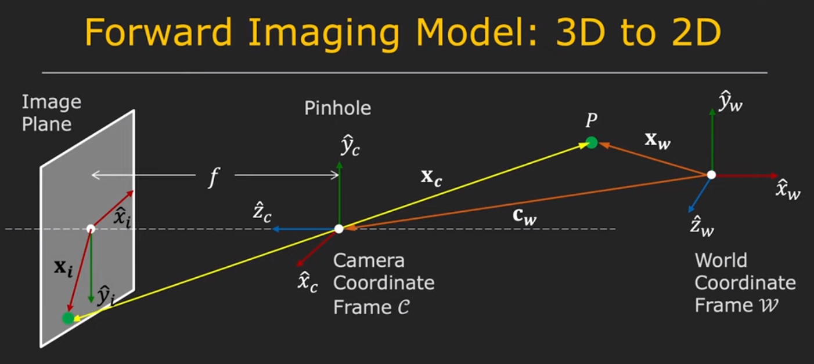
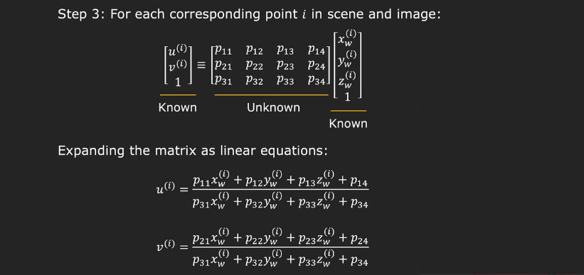

# Camera projection models

## Pinhole perspective camera model
 Pinhole camera model is a model of a camera that is used to project a point from the world to the image.

The pinhole camera model has the fllowing internal parameters:

- $f_x$ - focal length in the x direction ($f_x = f/k$)
- $f_y$ - focal length in the y direction ($f_y = f/l$)
- $o_x$ - x coordinate of the principal point
- $o_y$ - y coordinate of the principal point
- $\theta$ - skew factor between the x and y axis

The intrinsic matrix without skew is defined by the following equation:
$$ 
M_{int} = \begin{bmatrix}
f_x & 0 & o_x & 0 \\
0 & f_y & o_y & 0\\
0 & 0 & 1 & 0
\end{bmatrix}
$$

with the skew factor the calibration matrix part of the intrinsic matrix is:

$$
K = \begin{bmatrix}
f_x & -f_x \ctg \theta  & o_x \\
0 & \dfrac{ f_y }{\sin \theta} & o_y\\
0 & 0 & 1 
\end{bmatrix} 
$$
$$ 
M_{int} = \begin{bmatrix}
    K & 0 \\
\end{bmatrix}
$$

To project a point from the world to the image we need to use the following equation:

$$p_i = M_{int} p_c$$

where $p_c$ is the point in the camera coordinate system, $p_i$ is the point in the image, $R$ is the rotation matrix and $t$ is the translation vector.=
To transform a world point $p_w$ to the camera cordinate system we need to know the rotation matrix $R$ and the translation vector $t$. The transformation is done by the following equation:

$$p_c = R p_w + t$$

where $R$ is the rotation matrix and $t$ is the translation vector. We can combine the rotation matrix and the translation vector into a single matrix called the extrinsic matrix. The extrinsic matrix is defined by the following equation:

$$ 
M_{ext} = \begin{bmatrix}
R & t \\
0 & 1
\end{bmatrix}
$$

## orthographic projection matrix

The orthographic projection matrix is a matrix that projects a point from the world to the image. It is defined by the following equation:

$$
P = \begin{bmatrix}
1 & 0 & 0 & 0 \\
0 & 1 & 0 & 0 \\
0 & 0 & 0 & 1
\end{bmatrix}
$$

## Perspective projection matrix

The perspective projection matrix is a matrix that projects a point from the world to the image. It is defined by the following equation:

$$
P = \begin{bmatrix}
1 & 0 & 0 & 0 \\
0 & 1 & 0 & 0 \\
0 & 0 & -1 & 0
\end{bmatrix}
$$

## Transformation matrices
Translation matrix: (moves the point by the vector $t$)
$$
T = \begin{bmatrix}
1 & 0 & 0 & t_x \\
0 & 1 & 0 & t_y \\
0 & 0 & 1 & t_z \\
0 & 0 & 0 & 1
\end{bmatrix}
$$

Rotation matrix: ( rotates around z axis by the angle $\theta$)
$$
R = \begin{bmatrix}
\cos \theta & -\sin \theta & 0 & 0 \\
\sin \theta & \cos \theta & 0 & 0 \\
0 & 0 & 1 & 0 \\
 & 0 & 0 & 1
\end{bmatrix}
$$

Rotation matrix: ( rotates around x axis by the angle $\theta$)
$$
R = \begin{bmatrix}
1 & 0 & 0 & 0 \\
0 & \cos \theta & -\sin \theta & 0 \\
0 & \sin \theta & \cos \theta & 0 \\
0 & 0 & 0 & 1
\end{bmatrix}
$$
Rotation matrix: ( rotates around y axis by the angle $\theta$)
$$
R = \begin{bmatrix}
\cos \theta & 0 & \sin \theta & 0 \\
0 & 1 & 0 & 0 \\
-\sin \theta & 0 & \cos \theta & 0 \\
0 & 0 & 0 & 1
\end{bmatrix}
$$

Scaling matrix: (scales the point by the vector $s$)
$$
S = \begin{bmatrix}
s_x & 0 & 0 & 0 \\
0 & s_y & 0 & 0 \\
0 & 0 & s_z & 0 \\
0 & 0 & 0 & 1
\end{bmatrix}
$$

similarity matrix: (scales the point by the vector $s$ and rotates the point by the angle $\theta$ around the axis $u$) Keeps the lines parallel and keeps the angles between the lines.

affine matrix: (scales the point by the vector $s$, rotates the point by the angle $\theta$ around the axis $u$ and moves the point by the vector $t$) Keeps the lines parallel.

projective matrix: (scales the point by the vector $s$, rotates the point by the angle $\theta$ around the axis $u$, moves the point by the vector $t$ and projects the point to the image)

## Camera calibration

As we saw a camera has a lot of parameters that need to be calibrated. The calibration can be done by observing a known object in the world and finding the parameters that project the object to the image. For this purpose we often use a chessboard pattern. The chessboard pattern is a pattern that is easy to detect in the image and it has a lot of corners that can be used to find the parameters. The calibration is done by finding the corners in the image and finding the parameters that project the corners to the corners in the image.

# Affine image alignment

## Image aligment

Image aligment is a problem of finding the image transformation that wil minimize the difference between two images. The image aligment is used in many computer vision applications like panorama stitching, object tracking, object recognition, etc.
[Image transformations refresher](https://www.youtube.com/watch?v=B8kMB6Hv2eI)

## Image aligment using affine transformation

[Example template matching](https://www.youtube.com/watch?v=1_hwFc8PXVE)
The affine transformation is a transformation that preserves the parallelism of the lines. This means that the affine transformation can be used to transform the image. The affine transformation is defined using the following formula:

$$ 
\begin{bmatrix}
x' \\
y' \\
1
\end{bmatrix} = \begin{bmatrix}
a_{11} & a_{12} & t_x \\
a_{21} & a_{22} & t_y \\
0 & 0 & 1
\end{bmatrix} \begin{bmatrix}
x \\
y \\
1
\end{bmatrix}
$$

where $x$ and $y$ are the coordinates of the pixel in the original image, $x'$ and $y'$ are the coordinates of the pixel in the transformed image, $a_{11}$ and $a_{12}$ are the parameters of the transformation, $a_{21}$ and $a_{22}$ are the parameters of the transformation, $t_x$ and $t_y$ are the parameters of the transformation.

Error function:

$$ E = \sum_{i=1}^N \left( \left( a_{11} x_i + a_{12} y_i + t_x - x'_i \right)^2 + \left( a_{21} x_i + a_{22} y_i + t_y - y'_i \right)^2 \right) $$

where $x_i$ and $y_i$ are the coordinates of the pixel in the original image, $x'_i$ and $y'_i$ are the coordinates of the pixel in the transformed image.

## Rigid image alignment in frequency domain

There exists a solution to image aligment that dosent need iterative or optimization methods. It is based on the fact that the Fourier transform of the image is a complex number that has a magnitude and a phase. The magnitude of the Fourier transform of the image is the same for all images of the same object. The phase of the Fourier transform of the image is different for different images of the same object. This means that we can use the phase of the Fourier transform of the image to find the transformation that will align the images. The rigid image alignment in frequency domain is defined by the following equation:

$$ 
\begin{bmatrix}
x' \\
y' \\
1
\end{bmatrix} = \begin{bmatrix}
\cos \theta & -\sin \theta & t_x \\
\sin \theta & \cos \theta & t_y \\
0 & 0 & 1
\end{bmatrix} \begin{bmatrix}
x \\
y \\
1
\end{bmatrix}
$$

where $x$ and $y$ are the coordinates of the pixel in the original image, $x'$ and $y'$ are the coordinates of the pixel in the transformed image, $\theta$ is the angle of the transformation, $t_x$ and $t_y$ are the parameters of the transformation.

2D fast fourier transform:

$$ F(u,v) = \sum_{x=0}^{M-1} \sum_{y=0}^{N-1} f(x,y) e^{-j2\pi \left( \frac{ux}{M} + \frac{vy}{N} \right)} $$

where $F(u,v)$ is the Fourier transform of the image, $f(x,y)$ is the image, $M$ is the width of the image, $N$ is the height of the image, $u$ is the horizontal frequency, $v$ is the vertical frequency.
