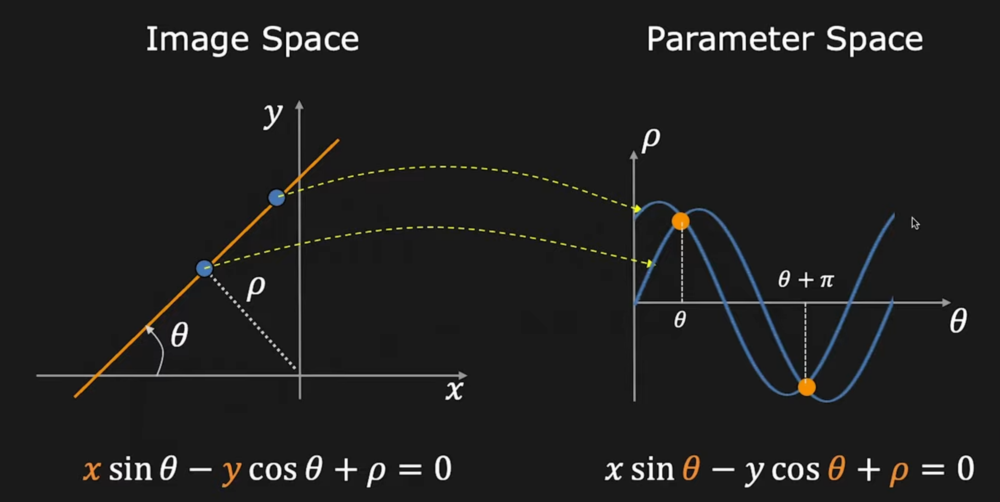
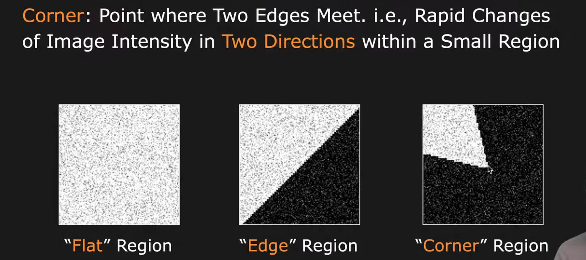

# Basic image segmentation

## Detecting boundaries

To successful segment the objects in the image we need a way to tell where a object starts and ends. In other words we are looking for the object boundary. Louckly object borders have sharp changes in intensity. This means that we can use the intensity gradient to find the object boundaries. The intensity gradient is calculated using the following formula:

$$ 
\nabla f = \begin{bmatrix}
\frac{\partial f}{\partial x} \\
\frac{\partial f}{\partial y}
\end{bmatrix}
$$

let say we have a grid of pixels like: 
$$ 
\begin{bmatrix}
20 & 25 & 30 \\
22 & 28 & 28 \\
20 & 24 & 26
\end{bmatrix}
$$
whats is the gradient of the pixel in the middle of the grid? The foward diference gradient is calculated using the following formula:

$$
\nabla f = \begin{bmatrix}
\frac{\partial f}{\partial x} \\
\frac{\partial f}{\partial y}
\end{bmatrix} = \begin{bmatrix}
\frac{28 - 22}{1} \\
\frac{24 - 28}{1}
\end{bmatrix} = \begin{bmatrix}
6 \\
-4
\end{bmatrix}
$$

where $f$ is the intensity of the pixel, $x$ is the x coordinate of the pixel and $y$ is the y coordinate of the pixel. The intensity gradient is a vector that points in the direction of the greatest change in intensity. The magnitude of the vector is the rate of change in intensity in that direction. We can use the magnitude of the intensity gradient to find the object boundaries. [There are multiple ways of calculating gradients](https://bartwronski.com/2021/02/28/computing-gradients-on-grids-forward-central-and-diagonal-differences/)

## Calculating pixel gradients
The pixel gradients describe the change intensity of the image in the x and y direction. The pixel gradients can be calculated in multiple ways.
1. foward difference
$$ 
\nabla f = \begin{bmatrix}
\frac{\partial f}{\partial x} \\
\frac{\partial f}{\partial y}
\end{bmatrix} = \begin{bmatrix}
\frac{f(x + 1, y) - f(x, y)}{1} \\
\frac{f(x, y + 1) - f(x, y)}{1}
\end{bmatrix}
$$
2. central difference
$$ 
\nabla f = \begin{bmatrix}
\frac{\partial f}{\partial x} \\
\frac{\partial f}{\partial y}
\end{bmatrix} = \begin{bmatrix}
\frac{f(x + 1, y) - f(x - 1, y)}{2} \\
\frac{f(x, y + 1) - f(x, y - 1)}{2}
\end{bmatrix}
$$
3. diagonal difference
$$
\nabla f = \begin{bmatrix}
\frac{\partial f}{\partial x} \\
\frac{\partial f}{\partial y}
\end{bmatrix} = \begin{bmatrix}
\frac{f(x + 1, y + 1) - f(x - 1, y - 1)}{2} \\
\frac{f(x - 1, y + 1) - f(x + 1, y - 1)}{2}
\end{bmatrix}
$$

## Edge detection in the image

Often when procesing the images in computer vision we want to know where the edges in the image are. There are many edge detectors that can be used to find the edges in the image. The most popular edge detectors are:

- Sobel edge detector
- Canny edge detector
- Laplacian edge detector
- etc.

### Sobel operator
Calculating the gradients can also be thought of as a convolution operation. The Sobel operator is a convolution kernel that can be used to calculate the gradients. The Sobel operator is defined as:
$$
G_x = \begin{bmatrix}
-1 & 0 & 1 \\
-2 & 0 & 2 \\
-1 & 0 & 1
\end{bmatrix}
$$
$$
G_y = \begin{bmatrix}
-1 & -2 & -1 \\
0 & 0 & 0 \\
1 & 2 & 1
\end{bmatrix}
$$
The gradients are calculated using the following formula:
$$
G_x * f = \begin{bmatrix}
-1 & 0 & 1 \\
-2 & 0 & 2 \\
-1 & 0 & 1
\end{bmatrix} * \begin{bmatrix}
f(x - 1, y - 1) & f(x - 1, y) & f(x - 1, y + 1) \\
f(x, y - 1) & f(x, y) & f(x, y + 1) \\
f(x + 1, y - 1) & f(x + 1, y) & f(x + 1, y + 1)
\end{bmatrix}
$$

## Hough transformation

Ok we know witch pixels form edges but how do we know witch pixels form a specific line? Here the Hough transformation comes in. 

We know 2 different types of Hough transformations for analitic an non-analityc transformations.

### Using analitycal transformation to represent lines:
clasical line eqation is 
$$ y = kx+n $$
normal or parametric line eqation is:
$$ x \cos \theta + y \sin \theta = r$$

This parametric representation can be transformed into Hougho parametric space where the parameters are $\theta$ and $r$.

The basic idea of hough transformation is to go through all edge pixels and transform them to the parametric space where we acumulate values. 

## Snake method

The idea of the snake method is to create a snake that will move along the object boundary. The snake is a curve that is defined by the following equation:

$$ E_{snake} = \int_0^1 E_{internal} + E_{external} dt $$

where $E_{internal}$ is the internal energy of the snake and $E_{external}$ is the external energy of the snake. The internal energy of the snake is defined by the following equation:

$$ E_{internal} = \frac{1}{2} \left( \alpha \left| \frac{dS}{dt} \right|^2 + \beta \left| \frac{d^2S}{dt^2} \right|^2 \right) $$

where $S$ is the snake, $t$ is the time, $\alpha$ is the elasticity of the snake and $\beta$ is the rigidity of the snake. The external energy of the snake is defined by the following equation:

$$ E_{external} = - \int_0^1 g(S(t)) \left| \frac{dS}{dt} \right| dt $$

where $g$ is the gradient of the image. The snake will move in the direction that minimizes the energy of the snake. The snake will move in the direction that minimizes the internal energy of the snake and maximizes the external energy of the snake. The snake will move in the direction that minimizes the internal energy of the snake and maximizes the external energy of the snake. 

## Corner detection in the image

Finding corners in a image is useful for many computer vision applications like camera calibration, object detection, object tracking, etc. There are many corner detectors that can be used to find the corners in the image. The most popular corner detectors are:
- Harris corner detector
- Shi-Tomasi corner detector
- FAST corner detector
- ORB corner detector
- etc.

### Harris corner detector

Harris corner detection is a method of finding corners in the image. Corners are points where two lines meet. The Harris corner detection algorithm is based on the following observation: if we move a window over a corner the intensity in the window will change a lot in all directions. If we move the window over a edge the intensity in the window will change a lot in one direction and not so much in the other direction. If we move the window over a flat area the intensity in the window will not change a lot in any direction. We can use this observation to find corners in the image. The Harris corner detection algorithm is defined by the following equation:

## Per pixel motion vectors
The idea is to calculate the motion for each pixel of the image. One aproach is to use the pixel gradients $\nabla f$ and the time difference between the images $\Delta t$ to calculate the motion vector $[u, v]$ using the following formula per pixel:
$$
\begin{bmatrix}
u \\
v
\end{bmatrix} = \begin{bmatrix}
\frac{f}{x} \\
\frac{f}{y}
\end{bmatrix} \Delta t
$$
