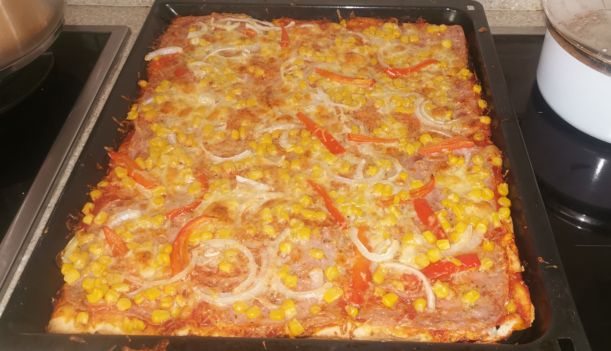

# Create a Pizza

## Ingredients

- 250 - 295g flour
- 1 packet of instant yeast
- 1 and 1/2 teaspoons of sugar
- 3/4 teaspoons of salt
- 2 tablespoons of olive oil
- 3/4 cup of warm water
- toppings of choice

## Mix the dough

Take the flour and mix it with salt and sugar. Add 2 tablespoons of olive oil, then start slowly adding water and kneading the dough. When mixing cover your hands in flower and make shure that dough absorbs all the water before adding more. Or use a kitchen aid.

## Prepare toppings

Cover the dough and leave it to rise for a hour. In the mean time prepare all the toping for the pizza.

- Tomato sauce with mixed in spices

(choose your toppings)
- grated cheese
- onions
- caned corn
- sliced ham
- caned mushrooms

When waiting preheat the oven to as high as it will go. I heated it up up to 280 degrees celsius.

## Place an bake

When the dough finished rising, take out a plater and smear margarine over it to prevent the pizza dough from sticking. Stretch the dough thin over the plater and place the toping in the way you fancy.

Put the pizza in the oven and bake it until it starts to change color to light brown.

## Enyoy

Take out the pizza and let it cool for a bit. Enjoy the pizza you made.
