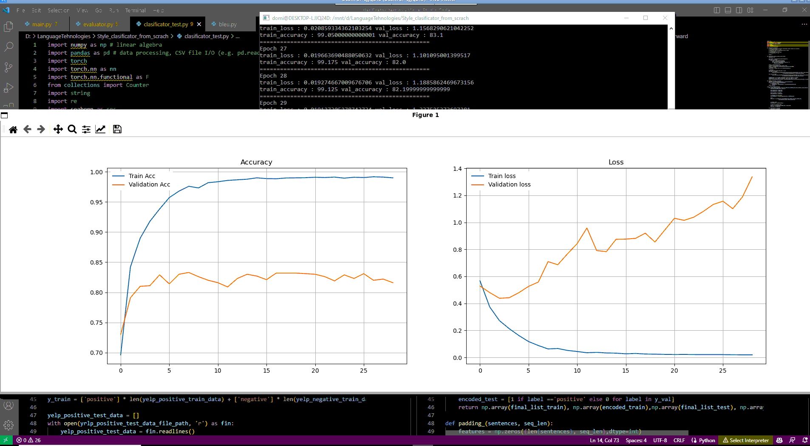

# Creating a style transfer neural network

The goal of this project is to try to replicate results from a paper, where text written in one style is transformed into text written differently while retaining the meaning. More specifically we will be creating two neural networks that can transform positive Yelp reviews into negative Yelp reviews and vice versa. The paper we will be recreating is [A Dual Reinforcement Learning Framework for Unsupervised Text Style Transfer](https://arxiv.org/pdf/1905.10060.pdf).


## Runing the code in the paper

The [paper code is available on github](https://github.com/luofuli/DualRL). To run the code you will need to install the following dependencies:
python==2.7
numpy==1.14.2
tensorflow==1.13.1
OpenNMT-tf==1.15.0

But becuse python 2.7 is no longer supported, we will be recreating the code in python 3.6 using tensorflow 1.x and OpenNMT-tf 1.15.0.

1. Clone the repository
2. Create a new conda (tf) environment
```bash
conda create --name tf python=3.6
conda activate tf
```
3. Install CUDA support 10.0 (if you have a GPU) [check for your tensorflow compatibility](https://www.tensorflow.org/install/source_windows#tested_build_configurations)
3.1 some prequisites
```bash
sudo apt update && sudo apt install gcc
sudo apt update && sudo apt install build-essential
sudo apt update && sudo apt install libglvnd-dev pkg-config
sudo apt update && sudo apt install freeglut3 freeglut3-dev libxi-dev libxmu-dev
```
3.2 install nvidia drivers
```bash
sudo add-apt-repository ppa:graphics-drivers/ppa
sudo apt-get update
ubuntu-drivers devices
sudo ubuntu-drivers autoinstall
```
3.3 install CUDA 10.0
```bash
conda install -c conda-forge cudatoolkit=10.0.0
pip install nvidia-cudnn-cu11==8.6.0.163
CUDNN_PATH=$(dirname $(python -c "import nvidia.cudnn;print(nvidia.cudnn.__file__)"))
export LD_LIBRARY_PATH=$LD_LIBRARY_PATH:$CONDA_PREFIX/lib/:$CUDNN_PATH/lib
mkdir -p $CONDA_PREFIX/etc/conda/activate.d
echo 'CUDNN_PATH=$(dirname $(python -c "import nvidia.cudnn;print(nvidia.cudnn.__file__)"))' >> $CONDA_PREFIX/etc/conda/activate.d/env_vars.sh
echo 'export LD_LIBRARY_PATH=$LD_LIBRARY_PATH:$CONDA_PREFIX/lib/:$CUDNN_PATH/lib' >> $CONDA_PREFIX/etc/conda/activate.d/env_vars.sh
```
4. Install the dependencies
```bash
pip install tensorflow==1.13.1
pip install OpenNMT-tf==1.15.0
pip install 
```

## Runing ubuntu 20.04 on windows 10 using WSL2
    - [CUDA on WSL2](https://docs.nvidia.com/cuda/wsl-user-guide/index.html)
    - [WSL2](https://docs.microsoft.com/en-us/windows/wsl/install-win10)

    -[Tensorflow + pytorch](https://gretel.ai/blog/install-tensorflow-with-cuda-cdnn-and-gpu-support-in-4-easy-steps)

## Classifying reviews as positive or negative

Before we can even start training our neural networks we need to classify the reviews as positive or negative. We can do this by using a simple neural network. We will be using a simple LSTM model with one hidden layer. The input to the model will be a sequence of numbers representing the words in the review. The output of the model will be a single number between 0 and 1. This number will represent the probability that the review is positive. We will be using the binary cross entropy loss function and the [Adam optimizer](https://arxiv.org/pdf/1412.6980.pdf).

### Data

For this example we will be using Yelp reviews dataset. The reviews considered positive are those with a rating of 4 or 5 and the negative reviews are those with a rating of 1 or 2. The reviews with a rating of 3 are ignored. The dataset contains 266041 positive and 177218 negative reviews, but we reduced it to 2000 positive and negative reviews for training, 500 positive and 500 negative reviews for testing, another 500 positive and 500 negative reviews for validation. The dataset can be downloaded from [here](https://www.kaggle.com/yelp-dataset/yelp-dataset).

### Training the classifier of positive and negative reviews



## Classifying content preservation

 Traning models from scratch is time consuming and expensive. So we use pretrained models found in , [Gensim](https://radimrehurek.com/gensim/) and [spaCy](https://spacy.io/).


## Training the style transfer neural network

Once we pretrained our clasificators we can start training our style transfer neural network. We will use our clasificators as a reward function. This will hopfuly teach the network to transform the reviews into the desired style. The reward function will be the following: ...


