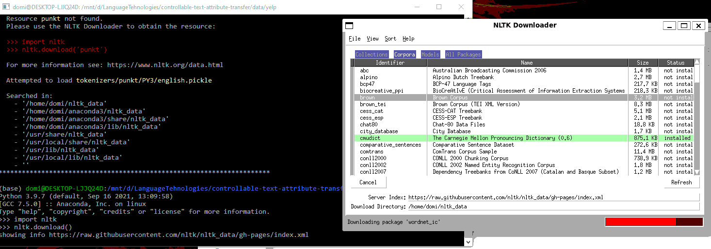

# Language processing

Language processing is a subfield of computer science, information engineering, and artificial intelligence concerned with the interactions between computers and human (natural) languages, in particular how to program computers to process and analyze large amounts of natural language data. Challenges in natural language processing frequently involve speech recognition, natural language understanding, and natural language generation.

## Parallel vs non-parallel corpora / supervised vs unsupervised

Natural language algorithms ca be developed in a supervised way, using parallel corpora, i.e a corpus of text in the source language and a corpus of text in the target language. The algorithm is trained to map the source text to the target text. For unsupervised style transfer, we can use non-parallel corpora, i.e. unpaired sentiment to sentiment translation. The algorithm is trained to map the source text to the target text, without the target text being available.


## Literature

- [Natural Language Processing with Python](http://www.nltk.org/book/)
- [RAZPOZNAVANJE IN KLASIFIKACIJA IMENSKIH ENTITET Z UPORABO UMETNIH NEVRONSKIH MREZ](https://dk.um.si/Dokument.php?id=132148&lang=slv)

## Links

- [RNN explained](https://www.youtube.com/watch?v=Y2wfIKQyd1I&ab_channel=codebasics)

- [Convolution neural networks in sentence classification](https://cnvrg.io/cnn-sentence-classification/)

- [Computational linguistics](https://en.m.wikipedia.org/wiki/Computational_linguistics)
- [WordNet](https://wordnet.princeton.edu/) - Lexical database for the English language
- [GNU Aspell](http://aspell.net/) - Spell checker
- [NLTK](http://www.nltk.org/) - Natural Language Toolkit
- [FastText](https://fasttext.cc/) - Library for efficient learning of word representations and sentence classification.
- [spaCy](https://spacy.io/) - Industrial-strength Natural Language Processing (NLP) with Python and Cython
- [KenLM](https://kheafield.com/code/kenlm/) - Fast and memory efficient language model toolkit

## Creating solutions in practice

- [How to build a text classifier with Python and the Natural Language Toolkit](https://towardsdatascience.com/machine-learning-nlp-text-classification-using-scikit-learn-python-and-nltk-c52b92a7c73a)

When creating a solution to a problem in the field of language processing, we have a lot of tools at our disposal. Many of these tools are open source and can be used for free, see the links above. Choosing the right tool can be daunting in the beginning, but with time and experience you will get a better understanding of the tools and their use cases. Lets give NLTK a try.

### NLTK

NLTK is a leading platform for building Python programs to work with human language data. It provides easy-to-use interfaces to over 50 corpora and lexical resources such as WordNet, along with a suite of text processing libraries for classification, tokenization, stemming, tagging, parsing, and semantic reasoning, wrappers for industrial-strength NLP libraries, and an active discussion forum.

#### Installation

Instalation is easy, just run the following command in your terminal:
```bash
pip install nltk
```
#### Downloading data

NLTK comes with a lot of data, but not all of it. To download all the data run the following command in your terminal:
```python
import nltk
nltk.download()
```
This will open a window where you can select the data you want to download.



#### Tokenization and vectorization
When working with text, we need to convert it into a format that can be used by a machine learning model. Because a machine learning model can only work with numbers, we need to convert the text into a vector of numbers.

One of the first steps is tokenization. Tokenization is the process of breaking a stream of text up into words, phrases, symbols, or other meaningful elements called tokens. Tokens can be individual words, phrases or even whole sentences. The NLTK library provides a number of ways to [tokenize text](https://www.nltk.org/howto/tokenize.html). The most common way is to use the word_tokenize() function. This function will break up a sentence into individual words and punctuation.


```python
from nltk.tokenize import word_tokenize
text = "Hello world. It's good to see you. Thanks for buying this book."
tokens = word_tokenize(text)
print(tokens)
```
Output:
```python
['Hello', 'world', '.', 'It', "'s", 'good', 'to', 'see', 'you', '.', 'Thanks', 'for', 'buying', 'this', 'book', '.']
```
The next step is to convert the tokens into a vector. This is done by using the CountVectorizer class from the sklearn library. The CountVectorizer class is used to convert a collection of text documents to a matrix of token counts. This implementation produces a sparse representation of the counts using scipy.sparse.csr_matrix.

```python
from sklearn.feature_extraction.text import CountVectorizer
vectorizer = CountVectorizer()
# fit the vectorizer on the tokens
vectorizer.fit(tokens)
# transform the tokens into a vector
vector = vectorizer.transform(tokens)
# print the vector
print(vector.toarray())
```

This way we converted plain text in our corpus into numerical vectors. These vectors can be used to train a machine learning model. 

#### Running a machine learning model

Now that we have our data in a format that can be used by a machine learning model. For example a LSTM model. We can train a model and use it to predict the next word in a sentence.

- [More on LSTM models](./LSTM_model.md)

## Exercise

### Finding scientific articles on the topic

- [Google Scholar](https://scholar.google.com/)
- [cobiss+](https://plus.cobiss.net/cobiss/si/sl/bib/search)
- [IEEE Xplore](https://ieeexplore.ieee.org/Xplore/guesthome.jsp)
- [ACM Digital Library](https://dl.acm.org/)
- [University of Maribor NIK](https://eds.s.ebscohost.com/eds/search/basic?vid=0&sid=9f26e2d4-8f9b-430b-b834-9f9d37f92190%40redis)

- [How to read a paper](https://web.stanford.edu/class/ee384m/Handouts/HowtoReadPaper.pdf)

### Recreating results from a paper

As a exercise we will try and recreate results from a paper in the field of language processing. With this we will get a better understanding of the field and the tools used in it.

### Some examples of scientific articles:
- [Melody-Conditioned Lyrics Generation with SeqGANs](https://ieeexplore.ieee.org/stamp/stamp.jsp?arnumber=9327976)
- [Automated generation of song lyrics using CFGs](https://www.researchgate.net/publication/286814466_Automated_generation_of_song_lyrics_using_CFGs)
- [Towards A Computational Model of Poetry Generation](https://www.researchgate.net/publication/2349215_Towards_A_Computational_Model_of_Poetry_Generation)
- [Natural language processing of lyrics](https://www.researchgate.net/publication/221573745_Natural_language_processing_of_lyrics)
- [Modeling Structural Topic Transitions for Automatic Lyrics Generation](https://aclanthology.org/Y14-1049.pdf)
- [Markov Constraints for Generating Lyrics with Style](https://www.researchgate.net/publication/236166532_Markov_Constraints_for_Generating_Lyrics_with_Style)
- [Automated Generation of Sinhala Lyrics using Recurrent Neural Networks](http://ir.kdu.ac.lk/bitstream/handle/345/2934/FOC%2096-106.pdf?sequence=1)

More examples might be found on: [Google Scolar](https://scholar.google.com/scholar?start=20&q=Automated+generation+of+song+lyrics&hl=sl&as_sdt=0,5)
