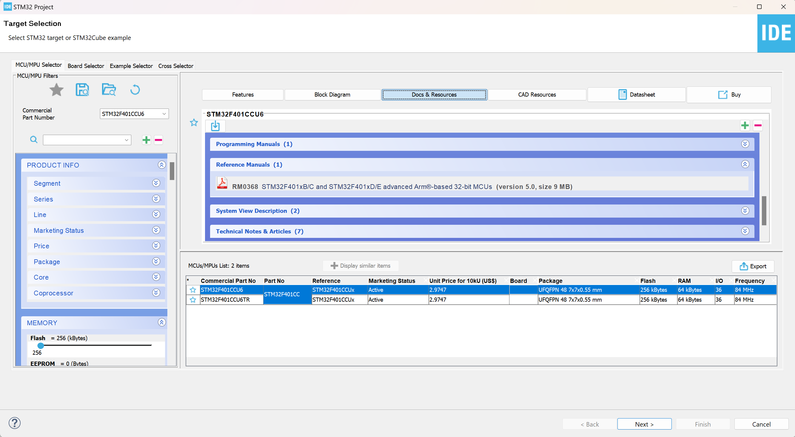

# Create new project

## Setting up STM32 project

For this tutorial we will be using the [STM32CubeIDE](https://www.st.com/en/development-tools/stm32cubeide.html). This will give us all the tools to easily program any STM32 microcontroler and more.

Steps:
1. Open STM32CubeIDE
2. Click on create new STM32Project
3. In board selector find your microcontroler
4. Download the reference manual for your microcontroler (this will help us understand all the microcontroler functionality)
5. Name and create your new project
6. In the config file .io first configure your main clock found under RCC.
7. Under clock configuration set the desired clock source and clock speed
8. Configure any other peripheral you need

STM32TargetSelector

## Library files
If in your project you decide to have library files outside the **\Src** and **\Inc** folders then we must specify under project properties the files location so the linker can find the library files.

1. Right click on project file
2. Chose project properties
3. Under C/C++ Build -> Settings -> Tool Settings -> MCU GCC Compiler -> Include paths: add the path to your library files

