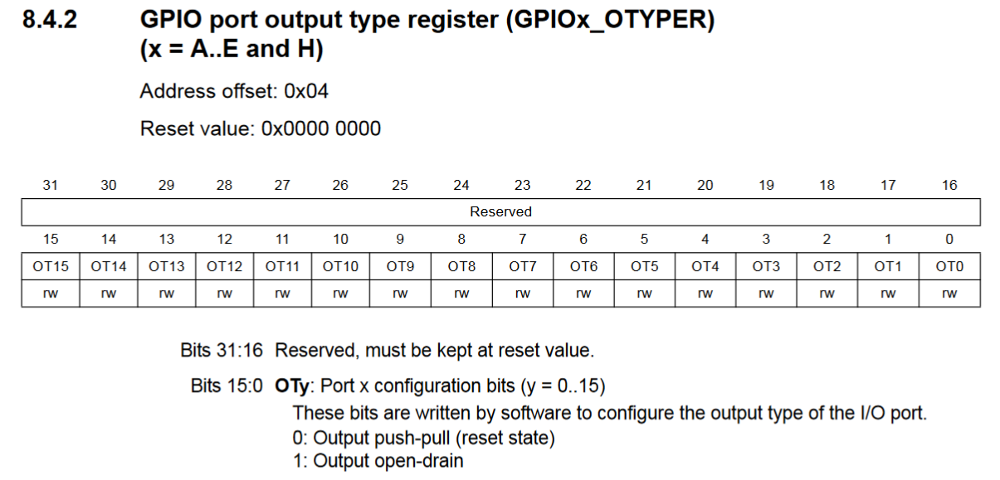

# Why use STM32

Learning to use STM32 type microprocessors gives us a better lov level knowledge of low systems involved in integrated circuit programing. While I can't really recommend using STM32 for simple hobby applications because using a Arduino would be much less painless. While Arduino IDE hides much of its logic behind abstractions and offers a wide selection of libraries. STM32CubeIde lays bare all of the operations going on behind the scenes to configure the microcontroler before we can even start executing our main program loop.

## How does microcontroler work

How does the CPU know witch of the GPIO pins are high or low. Firs we must understand how the CPU does anything. Almost all modern CPUs work based on the [Von Neuman computer architecture](../Computer_architecture/how_computers_work.md) witch how the building blocks of a CPU work with together to fetch and execute computer instructions.

The gist is that the computer reads instruction from memory and then manipulates that same memory to save the results of the instruction. Manipulating GPIO pins is no different than working with memory where we use special locations in memory called registers witch are directly contented to the function of peripheral devices.

## How do we work with registers

Registers to a programer are nothing more than some address in memory. To find that address we have to consult a memory map inside a reference manual that contains a lot of useful information on integrated systems of the microcontroler.

**Refrence manual can be downloaded from documentation tab in the STM32 Target selector.**

Inside the reference manual we also find detail instruction on what each bit inside each register does.

