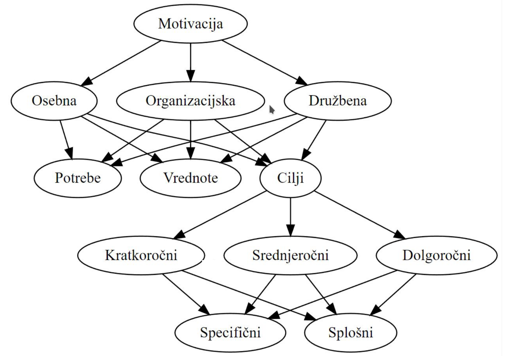

# Introduction

This is a collection of notes on ubiquitous computing. It is a work in progress.

## What is ubiquitous computing?

Ubiquitous computing is a field of study that focuses on the design of computing systems that are seamlessly integrated into the environment. The goal is to make computing invisible to the user. The user should not have to think about the computer, but rather focus on the task at hand.

### Wiser's definition

1. Computers must be able to sense the environment.
2. Computers must be able to communicate with each other.
3. Computers must be transparent to the user.
4. Human machine interfaces must be as undisruptive as possible.

### The four pillars of ubiquitous computing

1. Ubiquitous sensing
2. Ubiquitous communication
3. Ubiquitous computing
4. Ubiquitous interaction

## Examples of ubiquitous computing

- [Smart home](https://en.wikipedia.org/wiki/Smart_home)
- [Smart city](https://en.wikipedia.org/wiki/Smart_city)
- [Smart phone](https://en.wikipedia.org/wiki/Smartphone)
- [Google glass](https://en.wikipedia.org/wiki/Google_Glass)
- [Smart watch](https://en.wikipedia.org/wiki/Smartwatch)
- [Smart glasses](https://en.wikipedia.org/wiki/Smart_glasses)

## Motivation

Humans have a number of needs that can be covered with a help of a computer.
Those needs drive the development of ubiquitous computing and help us define our goals. [More...](./covering_the_human_needs.md) 

